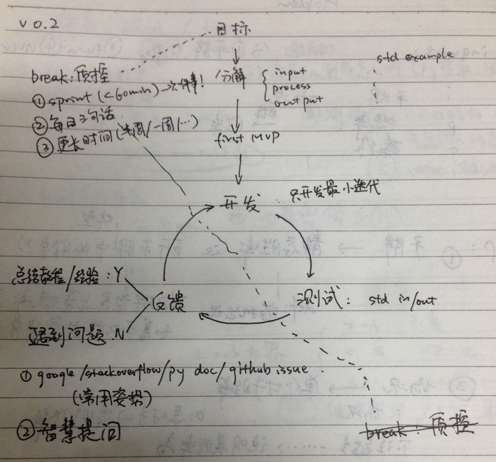

# 结业典礼--Frank Hu 的分享稿

### 提纲
- 背景
- 动机
- 困难
- 转折点
- 建议

---
1. 背景: 
  - 在读理科博士僧一枚 7年前在学校学过一点C语言, 但只能算是应付考试, 没有实际工程经验. Python 经验为 0. 
2. 动机: 
  - 初心: 用一段相对集中的时间尝试学习新的东西, 看看自己在其它领域会有什么表现; (对技术的兴趣转化为职业方向的可行性? 个人三个月最小化的 MVP 测试)
3. 困难: 
  - 不会游泳就直接被扔到海里: 完全不知道从哪里下手; 几个初始任务的岩钉: RiceU mooc 其实解决了我的很多问题
  - 最后写了 不确定情况下的学习
4. 转折点
  - 第一份作业: (看自己最快需要多长时间才能完成?)照葫芦画瓢--不懂也要写程序, 四处抄写代码段.开始从学校的先学再用到边学边用的转变. 
     - 先动起来(MVP): 技术问题在你有了尝试之后, 大家才能有切实的讨论基础
     - "我怎么做到xxx" 与 "我为了完成xxx, 写了代码yyy, 目前只能实现zzz, 问题出在哪里?": 后者能让他人容易明白你的问题, 以及如何帮助你.
  - 教程: 写的时候才知道自己到底会什么. 写教程时候的知识迭代和查漏. (写技术教程和个人博客的习惯十分有必要, 要坚持.)
     - 反转: 因材施教(学生的个体差异)也许是教育最大难点. 但只有自己才知道自己到底需要什么, 大妈只能在旁边辅助----教程实际上都是给自己写的, 并没有给他人写的教程
  - talk is cheap: 团队协作的务虚和务实. 我用过错误姿势(只是试图每天推动小伙伴们写代码, 自己也不写, 仓库一周没有任何更新)和正确姿势(先完成 MVP 再进行讨论, 面对面交流): 尽量多做有生产力的事.不同队员的思维难以连接; 多当面交流----自己的一大遗憾
  - 时间: 每周~10小时; 分配: 极简----从务虚到务实, 尽量增加bench coding时间, 保留足够的反省, 压缩务虚的闲聊和低效输入(网上教程中最有效的是正确代码示例, 拿过来改改就能用. )
5. 建议:
  - 好学比学好更重要: 开始尝试是最重要的一步; 极简----不要在选择上花太多时间
  - 接受学习的现实: 不可避免的错误; 不确定性(没有充分尝试就放弃, 实在遗憾…)
  - 时间投入: 10h/week 是基本线, 每天工程化记录, 不要幻想一瞬间凑够 10 小时

----
最后的安利:   
Py 学习之轮

