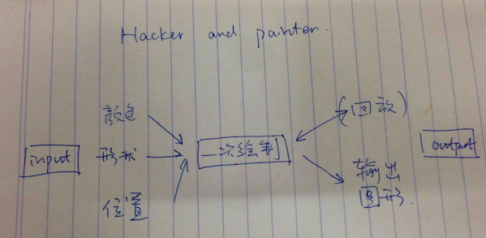

# "Hacker and Painter"

Copyright [Frank Hu](https://github.com/Frank-the-Obscure), 2015

## 本周计划: 尽量多写代码,在实践中找语法关键点

20150330

- finish outline v1.0 on paper
- photo here
- 
- 计划按照要求级别不断迭代优化

20150331

- write v1.0
  - canvas函数语法不会用
  	 - google 一番,起初无收获,折腾了20min
  	 - 其实找到的 tk 官网也不错,但不如后来效率
  	 - 最后认识到应该在 CodeSkulptor 进行搜索,找到了官方文档
  - 发现 canvas 只能一次画一个图形
     - 因此要依靠 list or dict 与 for 循环来实现绘图
       - 多重 list 依靠相同的 index 同步
       - 正解应该是面向对象编程,对象有三个方面的参数
       - 此次先用 basic skill 写也可
     - 最基本的版本完成,可以画出很多个圆圈了.
     - 后续可以不断添加 input/output 功能,查看有效输出反馈
     
- while 死循环...
 - 类型不同的比较? i 似乎被默认搞成了 string?
 - 仍有问题,怀疑是 draw_handler 的毛病:似乎这个玩意一直在死循环
     - 经过测试果然如此! 其实并不是 while loop 的问题

20150401

- 20:45 经典错误之 = 应为 ==
- 20:54 形状修改完成
- 21:13 label 似乎不可以用变量赋值,查CodeSkulptor也只有静态赋值的例子
  - 改成在画布输出当前信息
- 21:57 计划用正则表达式匹配颜色和回放速度的输入
  - 函数并不好写,且 rgb 格式匹配麻烦
  - 正则表达式具有更好的通用性
- 22:13 设计回放架构
  - 可以使用一个临时列表存放当前信息,重置画布后逐个添加
  - 实践发现一瞬间就添加完了
  - `卡住`
  - 23:20 想出算法
  - 因 draw 实际在用死循环画图
  - 需要不断改变进入循环的图形数量
  - 把循环的图形数量放入 tick 函数中才可解决
  - `系统化的解法`: 让`我想做`和`程序可做`相互 pk, 寻找共同点
    - 此例: 
      - 我想按一定间隔(tick)改变图形数量;
      - 程序会把加入的图形瞬间画出来
      - 因此我必须按一定间隔加入图形(或者找一个能按顺序添加的函数库代替 canvas 这个死循环绘图法)
      - 即把加入图形的数量变量放入 tick

20150402

- 06:42 输出文件----何类文件?
- 暂理解为最终图片或者回放过程
- 07:19 搜索 codeskulptor 无相关命令,网上 canvas 输出图片教程是在本地操作,看来要在本地才可直接输出为文件.
  - 因本地还未装 simplegui module,暂缓输出
  - 先优化其余细节:如输入鲁棒性
- 07:50 数字正则表达式已解决----网上找到表达式测试可用
  - 写好的正则表达式不是一日之功,目前先用起来(感觉正解是搞到一本正则表达式的 recipe)
- 19:48 regex 已完全解决
- 20:23 除保存回放功能以外的功能已完成,考虑先提交,再修改 bug 并补充功能.
- 20:40 开始把写在纸上的记录誊写到电脑(程序框架纸原版不在手边,重画,不如原版有修改痕迹,待找回更换)