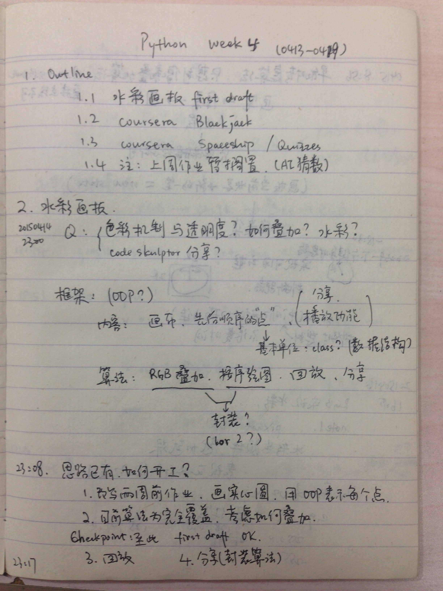

#Hacker and painter, watercolor version

##resourses

[color note found in pixnet](http://ayu6628.pixnet.net/blog/post/4807180-%E8%89%B2%E5%BD%A9%E8%A7%80%E5%BF%B5-%E7%B0%A1%E8%BF%B0rgb%E8%88%87cmyk)

[RGB to CMYK algorithm](http://www.rapidtables.com/convert/color/rgb-to-cmyk.htm)

[CMYK to RGB algorithm](http://www.rapidtables.com/convert/color/cmyk-to-rgb.htm)

