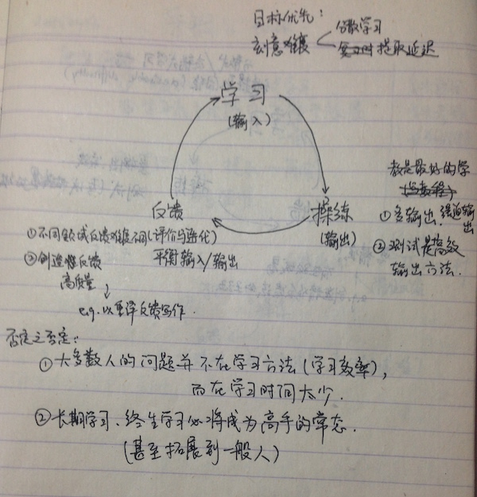

# 缘起

听过采铜老师精彩的讲座，跃跃欲试的心情——

操作起来，却不那么容易

  - 听过就忘了？
  - 技巧太多，选择无能？
  
再看看我们的 python 学习过程?

OMOOC.py 形成以下信息回路:[http://wiki.zoomquiet.io/omooc/week4QA]

微信
 ^ \
 |  +- 列表
 |     \
 |      +- 任务 (163 SPOC)
 |         \
 ^          +- github
 |              +- gitbook 私人教程
 |              +- 私人/团队代码 作业/项目
 |             /
 +-----<------+

大妈构建的良好信息回路, 我们听过之后执行得好吗? 可不可以变的更好?

还有更大的困难: `比起学习的效率，更重要的问题也许是学习的时间`？

  - “我觉得现在学习者的问题是，输入的量远远不够，输出的量也远远不够，所以感觉关键不在这个比值”——采铜
  - "没有笨学生,只有慢学生"----大妈

我们学习 python 的过程,最大的困难似乎并不是智力----

  - 我们完不成任务的最大原因,是不是没有投入足够的时间,而不是学习效率不够?

嗨，小伙伴们，正好我们正在学python耶！

  - 来一个诡异的自指如何？(GEB 脑残粉来了)
  - 自己给自己造一个学习帮手吧!
  - `Python 学习之轮`

------

# 用 Python 架设 web app，助推 Python学习本身

学习 python 同时，通过各种方法助推更多的学习时间, 同时体验各种高阶学习技巧

考虑实现以下功能:

 - 用户登陆 
 - 每日提醒: 
    - 通过系统化的模式, 尝试提醒用户多使用科学的工具, 提升编程/学习效率
    - 如:
    - 每日三句话/提问的艺术/复习考核时间…
  - 记录学习过程并提供适当反馈
    - 围绕着 教程/任务/项目 为核心的学习模式
    - 助推大妈提倡的编程信息流
    - 最基本: 通过用户输入记录真实学习时间/关键事件时间戳
      - 得到真实的时间投入
    - 后续任务提醒: 避免选择无能;
      - 模仿 IFTTT 的设计理念
      
			If 完成了一个程序模块, then 提醒 push github 并更新相应教程
			If 遇到了一个困难, then 提醒要开始记录自己的尝试
			If 解决不了想提问了, then 提醒运用 提问的艺术
			If 遇到了 bug, then 提醒使用小黄鸭调试法分解问题
			……
     - 还应该有什么功能? 我也不知道……

把有限的学习时间用于创造, 把一切脏活累活,放心交给电脑吧:)

最终，转化为`一个带有初步互动性的 python 学习帮手`(?)

  - 既学习 python，又通过学习 python 演练学习技巧
  - 给以后的同学们留下一个助推器
  
对于这个轮子的推手——我们
    - 这是不是可以成为一本给六个月前的自己——最好的 python 教程的 cheat sheet？
    
更远的想象: 把这个 web app 拓展到其它领域的学习?

以上, 大约源于我内心深处又一个幼稚的想法：让人做只有人才能做的事情，其它事情交给电脑吧！

------

# (伪)可行性分析
web app: 廖雪峰 blog

类似应用:

  - [IFTTT](http://zh.wikipedia.org/wiki/IFTTT)
  - [Code school - try git](https://try.github.io/levels/1/challenges/1)

------

# 呼唤小伙伴
以上是我的 yy, 能不能变成现实...嗯...首先要看...有木有程序员?

- 人数: 4 (包括 yy 正 high 的我)
- 每周工作时间: 预计每人 10h/week (benck work 预计 5h/week)
  - 请确保有时间/有决心强行创造时间达到 5h/week 的 bench work 时间
  - 并在整个项目期间坚持下来
  - (照了照镜子, 细思恐极, 难道自己要被自己枪毙出 team 了吗...)
- 联系方式:
  - email
  - 微信群昵称 Frank Hu
  - 欢迎互相围观